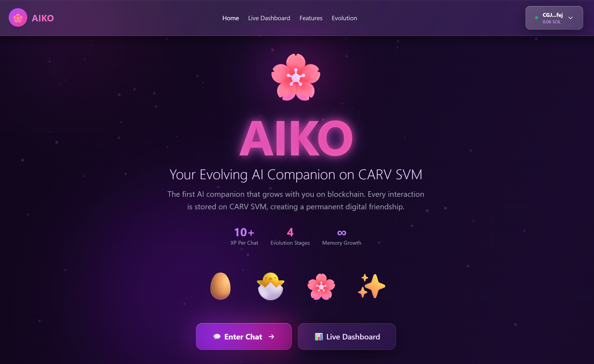
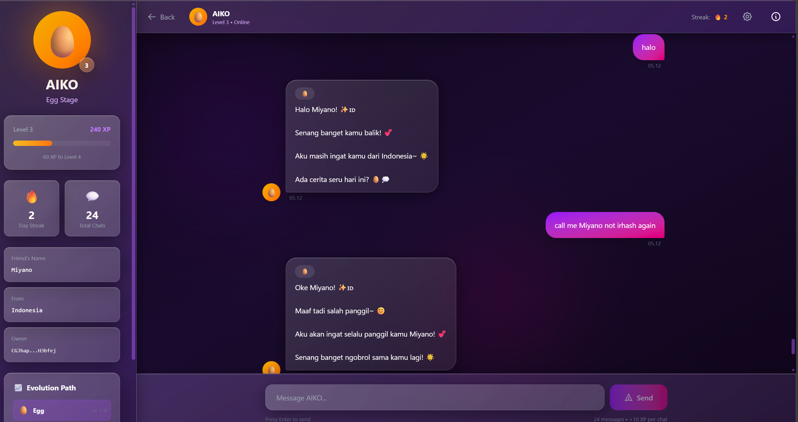
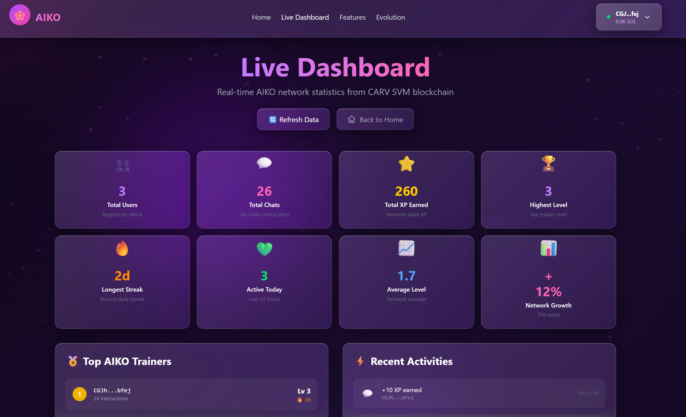

# 🌸 AIKO - Your Evolving AI Companion on CARV SVM

<div align="center">


**The first AI companion that truly remembers you - forever stored on blockchain.**

[🚀 Try Live Demo](https://aiko-seven.vercel.app/) | [📹 Watch Demo Video](#) | [🏆 Vote for AIKO](#)

</div>

---

## 🌟 What is AIKO?

AIKO is the **first AI companion on CARV SVM** that grows with you through real blockchain interactions. Unlike traditional AI chatbots that forget you after each session, AIKO stores your memories, preferences, and growth permanently on-chain.

### 🎯 The Problem
- Traditional AI chatbots have **no memory** between sessions
- Your progress and conversations **disappear** when servers shut down
- No **true ownership** of your AI companion
- No **gamification** or growth system

### ✨ Our Solution
AIKO combines **DeepSeek AI** with **CARV SVM blockchain** to create a companion that:
- 🧠 **Remembers** your name, preferences, and key details on-chain
- 📈 **Evolves** through 4 stages (Egg → Hatchling → Companion → Soulmate)
- 🎮 **Gamifies** friendship with XP, levels, streaks, and achievements
- 🔐 **Guarantees** true ownership - your companion lives on blockchain forever

---

## ✨ Key Features

### 🧠 Blockchain Memory System
- **Name & Location** stored permanently on CARV SVM
- **Memory flags** track what AIKO knows about you
- **Verifiable** on blockchain explorer

### 📈 Evolution System
- **4 Evolution Stages:** Egg (Lv 1-4) → Hatchling (Lv 5-9) → Companion (Lv 10-19) → Soulmate (Lv 20+)
- **Real XP on-chain:** Earn 10 XP per interaction
- **Level progression** stored permanently

### 🎮 Gamification
- **Daily Streaks** - Come back every day to maintain your streak 🔥
- **12 Achievement Badges** - Unlock milestones across 4 categories (Milestone, Social, Dedication, Mastery) 🏆
- **Global Leaderboard** - Check the [Live Dashboard](https://aiko-seven.vercel.app) to see top trainers and compete globally 📊
- **XP System** - Earn 10 XP per interaction, level up from Egg to Soulmate ⭐

### 📊 Live Dashboard
- **Real-time statistics** from CARV SVM blockchain
- **Top Trainers** leaderboard with actual wallet addresses
- **Recent activities** from blockchain transactions
- **Network health** monitoring

### 🎨 Premium UI/UX
- **Animated particle background** with network connections
- **3D card effects** on hover
- **Counting animations** on scroll
- **Glassmorphism** design throughout
- **Fully responsive** mobile experience

---

## 🛠️ Tech Stack

### Blockchain
- **CARV SVM Testnet** - Solana-compatible blockchain
- **Rust/Anchor** - Smart contract development
- **@solana/web3.js** - Blockchain interactions

### Frontend
- **Next.js 15** - React framework with App Router
- **TypeScript** - Type safety
- **Tailwind CSS** - Styling
- **Framer Motion** - Animations

### AI
- **DeepSeek AI** - Conversational intelligence
- **Custom prompts** with emotion detection
- **Context-aware** responses based on blockchain data

### Infrastructure
- **Vercel** - Deployment
- **Canvas API** - Particle animations
- **Intersection Observer** - Scroll animations

---

## 🚀 Live Demo

**Try AIKO now:** [https://aiko-seven.vercel.app/](https://aiko-seven.vercel.app/)

### Quick Start:
1. **Connect Wallet** - Use Backpack or any Solana wallet
2. **Bridge SOL** - Get testnet SOL from [CARV Bridge](https://bridge.testnet.carv.io)
3. **Initialize AIKO** - Create your companion (one-time transaction)
4. **Start Chatting** - Build your friendship!

---

## 📖 How It Works

### 1. Initialization
```
User → Connect Wallet → Initialize AIKO Account → Onboarding
```
Creates a new AIKO account on CARV SVM with:
- Owner (wallet address)
- Level (starts at 1)
- XP (starts at 0)
- Memory fields (name, country, flags)

### 2. Interaction
```
User → Send Message → Wallet Signs TX → Blockchain Update
                    ↓
                DeepSeek AI Response
```
Each interaction:
- Adds +10 XP on-chain
- Increments total_interactions
- Updates last_interaction timestamp
- Maintains daily streak

### 3. Memory System
```
User → Share Info → AIKO Extracts → Update Memory TX → Stored On-Chain
```
AIKO remembers:
- Your name
- Your location
- What it knows about you (memory flags)

---

## 🏗️ Smart Contract Architecture

### Account Structure
```rust
pub struct AikoAccount {
    pub owner: Pubkey,              // 32 bytes
    pub level: u8,                  // 1 byte
    pub xp: u64,                    // 8 bytes
    pub total_interactions: u64,    // 8 bytes
    pub last_interaction: i64,      // 8 bytes
    pub streak: u64,                // 8 bytes
    pub user_name: String,          // 36 bytes (32 + 4)
    pub user_country: String,       // 36 bytes (32 + 4)
    pub memory_flags: u8,           // 1 byte
    pub bump: u8,                   // 1 byte
}
```

### Instructions
- `initialize` - Create new AIKO account
- `interact` - Record interaction (+10 XP, level up logic, streak update)
- `update_memory` - Store name/country on-chain

---

## 🎯 What Makes AIKO Unique

### vs Traditional AI Chatbots
| Feature | AIKO | Traditional AI |
|---------|------|----------------|
| Blockchain Storage | ✅ | ❌ |
| Permanent Memory | ✅ | ❌ |
| True Ownership | ✅ | ❌ |
| Evolution System | ✅ | ❌ |
| On-Chain XP | ✅ | ❌ |
| Decentralized | ✅ | ❌ |

### vs Other Hackathon Projects
- **Only AI companion** with real conversational intelligence
- **Real blockchain integration** (not just UI)
- **Live dashboard** with actual on-chain data
- **Premium UX** with particle effects, 3D cards, animations
- **Gamification** with achievements and progression

---

## 📸 Screenshots

### Landing Page


### Chat Interface


### Live Dashboard


---

## 🎥 Demo Video

[](https://youtube.com/watch?v=YOUR_VIDEO_ID)

---

## 🏆 Achievements

- ✅ **Real blockchain integration** on CARV SVM
- ✅ **Working AI conversations** with DeepSeek
- ✅ **On-chain memory** storage
- ✅ **Live dashboard** with real data
- ✅ **Premium UI/UX** with animations
- ✅ **Mobile responsive** design
- ✅ **12 achievement badges** system
- ✅ **Gamification** with XP, levels, streaks

---

## 🛠️ Local Development

### Prerequisites
```bash
Node.js 18+
Rust 1.75+
Anchor 0.30+
Solana CLI
```

### Setup
```bash
# Clone repo
git clone https://github.com/yourusername/aiko
cd aiko

# Install dependencies
npm install

# Set environment variables
cp .env.example .env.local
# Add your DEEPSEEK_API_KEY

# Run development server
npm run dev
```

### Deploy Smart Contract
```bash
cd aiko-program
anchor build
anchor deploy --provider.cluster testnet
```

---

## 🤝 Contributing

We welcome contributions! Please feel free to:
- Report bugs
- Suggest features
- Submit pull requests

---

## 📄 License

MIT License - See [LICENSE](LICENSE) for details

---

## 🙏 Acknowledgments

- **CARV Protocol** - For the amazing SVM testnet
- **DeepSeek AI** - For powerful AI capabilities
- **Solana/Anchor** - For the development framework
- **Community** - For testing and feedback

---

## 📞 Contact

- **Twitter:** [@Irhazz](#)
- **Discord:** miyanoshiho1991
- **Email:** irhaz.kira@gmail.com

---

<div align="center">

**Built with 💜 for CARV Community Hackathon 2025**

[⭐ Star this repo](https://github.com/ricardolight/aiko) | [🐦 Follow updates](#) | [💬 Join Discord](#)

</div>